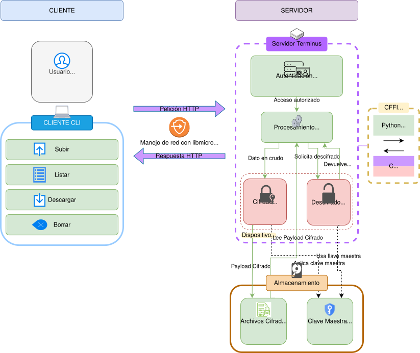

# Terminus

Servidor de archivos personal, ligero y seguro con cifrado en reposo (ChaCha20-Poly1305). Combina un núcleo en C (libmicrohttpd + libsodium) para el manejo de red y criptografía con una capa de control en Python.

## Arquitectura



## Características

- **Cifrado en reposo:** ChaCha20-Poly1305 mediante libsodium para cada archivo almacenado.
- **Autenticación:** Acceso protegido mediante Bearer Token.
- **Núcleo híbrido:** Servidor HTTP y operaciones criptográficas en C para alto rendimiento; lógica y enrutamiento en Python.
- **API REST:** Operaciones para subir, descargar, consultar metadatos, listar y eliminar archivos.

## Prerrequisitos

Para compilar y ejecutar localmente sin Docker necesitas:

- Compilador de C (`gcc` o `clang`), `cmake` y `make`.
- Bibliotecas de desarrollo de `libsodium` y `libmicrohttpd`.
- Python 3.8+ y `pip`.

En distribuciones basadas en Arch Linux:

```bash
sudo pacman -S gcc cmake pkg-config libsodium libmicrohttpd python python-pip
```

En Debian/Ubuntu:

```bash
sudo apt update && sudo apt install build-essential cmake pkg-config libsodium-dev libmicrohttpd-dev python3 python3-pip python3-venv
```

## Configuración

Antes de iniciar, se deben definir las credenciales y rutas tanto para el servidor como para el cliente.

### Servidor (`config.json`)

Crea el archivo `config.json` en la raíz del proyecto:

```json
{
  "server_port": 8080,
  "storage_directory": "terminus_storage",
  "api_secret_token": "tu_token_secreto"
}
```

> Puedes generar un token seguro ejecutando:  
> `python -c 'import secrets; print(secrets.token_urlsafe(32))'`

### Cliente (`client_config.json`)

Crea `client_config.json` en la raíz del proyecto con el mismo token:

```json
{
  "server_url": "http://127.0.0.1:8080",
  "api_token": "tu_token_secreto"
}
```

## Despliegue con Docker

Es la forma más directa de levantar el servidor sin configurar dependencias en el sistema anfitrión:

```bash
# Iniciar en primer plano
docker compose up --build

# Iniciar en segundo plano
docker compose up --build -d

# Detener el servicio
docker compose down
```

## Compilación y Ejecución Manual

Si prefieres ejecutar directamente en tu entorno:

1. **Entorno virtual de Python:**
   ```bash
   python -m venv venv
   source venv/bin/activate
   pip install -r requirements.txt
   ```

2. **Compilar el núcleo de C:**
   ```bash
   bash scripts/build.sh
   ```

3. **Iniciar el servidor:**
   ```bash
   python src/python_wrapper/main_server.py
   ```

## Uso del Cliente CLI

Con el servidor en ejecución, puedes interactuar mediante `client.py`:

```bash
# Listar archivos en el servidor
python client.py list

# Subir un archivo
python client.py upload /ruta/al/archivo.txt archivo.txt

# Descargar un archivo
python client.py download archivo.txt copia_descargada.txt

# Eliminar un archivo
python client.py rm archivo.txt
```

## Referencia de la API

Las peticiones a endpoints protegidos deben incluir la cabecera:  
`Authorization: Bearer <api_secret_token>`

| Método | Endpoint | Descripción |
| :--- | :--- | :--- |
| `GET` | `/status` | Verifica estado y versión del servidor (público) |
| `GET` | `/files` | Lista los archivos almacenados |
| `POST` | `/files/{filename}` | Sube y cifra un archivo (cuerpo binario) |
| `GET` | `/files/{filename}` | Descarga y descifra un archivo |
| `DELETE` | `/files/{filename}` | Elimina un archivo del servidor |
| `GET` | `/files/{filename}/info` | Obtiene tamaño y metadatos del archivo |

## Licencia

[MIT](LICENSE)
